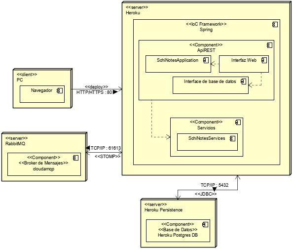

# Diagramas

Para entender mejor la herramienta, diseñamos los modelos de componentes, de datos y de clases, y así lograr mostrar la estructura, cómo está compuesta y cómo funciona nuestra herramienta.

* Modelo de Datos:

* Diagrama de Clases:

* Diagrama de Componentes:

* Diagrama de Despliegue:

