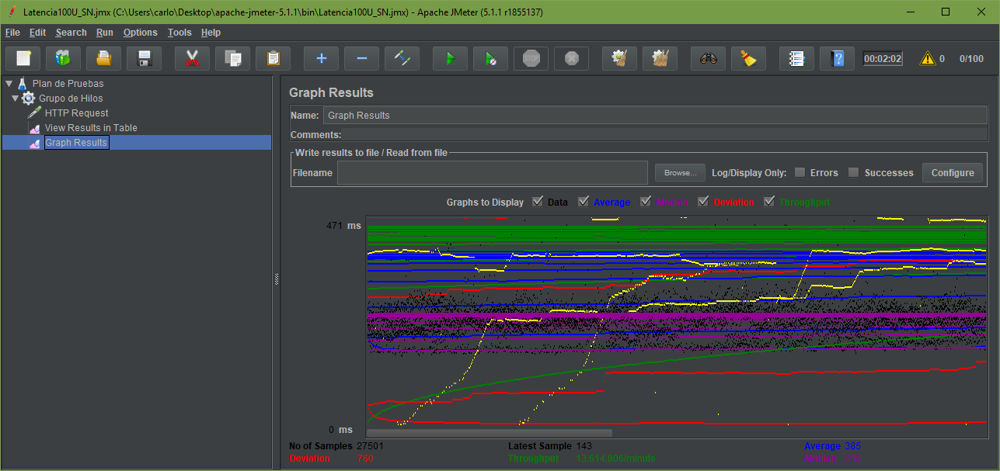

# Escenarios de Calidad

En la siguiente tabla, se encuentran todos los atributos de calidad con su detalle y que se deben de tener en cuenta durante el desarrollo de la herramienta colaborativa SchiNotes.

| **Código** | **Descripción** | Atributo de Calidad |
| :--- | :--- | :--- |
| AT01 | La herramienta debe permitir cualquier tipo de actualización y en cualquier momento sin alterar su funcionamiento. | Flexibilidad |
| AT02 | La herramienta debe ser bastante intuitiva, de manera que sea fácil de acceder y de usar. | Usabilidad |
| AT03 | La herramienta debe llevar a cabo todas las operaciones de las que disponga sin generar ningún contratiempo. | Fiabilidad |
| AT04 | La herramienta debe ser capaz de entregarle al usuario un recurso siempre que este lo necesite y estar operativo las 24 horas del día. | Disponibilidad |
| AT05 | La herramienta debe proteger los datos de los usuarios contra un acceso no autorizado. | Integridad |
| AT06 | La herramienta debe ofrecer coherencia entre las operaciones que realiza el usuario. | Consistencia |
| AT07 | La herramienta no debería tardar mucho tiempo al realizar una petición de un usuario. | Latencia |
| AT08 | La herramienta deberá asegurar la información de los usuarios registrados como sus credenciales y que ninguna persona que no se haya autenticado correctamente pueda ingresar. | Seguridad |

**Escenario de Usabilidad:**

“Nuevos usuarios usan por primera vez la herramienta.”

1. **Fuente:** Usuario.
2. **Estímulo:** Usar la herramienta \(registrarse, entrar - login, crear un horario, crear una actividad, …\).
3. **Entorno:** Herramienta colaborativa finalizada y operativa. Se usó firefox como navegador.
4. **Artefacto:** Toda la herramienta ya operativa.
5. **Respuesta:** La herramienta presentará un estructura simple y fácil de utilizar en donde las utilidades de la herramienta estarán disponibles desde la pantalla de inicio.
6. **Métrica:** El número de clics para entrar a cada una de las funcionalidades de la herramienta tendrá que se menor o igual a 3.
7. **Atributo de calidad afectado:** AT02

**Escenario de Disponibilidad:**

“Si el usuario intenta acceder a la herramienta pero el servicio se ha denegado por alguna razón el usuario debe ser avisado de este fallo”

1. **Fuente:** Usuario registrado en la herramienta.
2. **Estímulo:** Interacción en la página realizando diferentes operaciones.
3. **Entorno:** Herramienta colaborativa finalizada y operativa.
4. **Artefacto:** Toda la herramienta ya operativa.
5. **Respuesta:** Mensajes de alerta con colores dependiendo de la falla, indicándole el error que ha surgido y que lo vuelva a intentar.
6. **Métrica:** Todos los usuarios que estén usando la aplicación deben conocer el error que surgió, de manera que intenten posteriormente realizar las diferentes operaciones que trataron de ejecutar.
7. **Atributo de calidad afectado:** AT04

**Escenario de Integridad:**

“Usuarios sin registro intentan acceder a la herramienta para modificar la base de datos \(esto es crear horarios, actividades, entre otros\), sin embargo no podrán ya que no poseen los permisos necesarios por no tener una cuenta.”

1. **Fuente:** Usuarios sin registro en la aplicación.
2. **Estímulo:** Intentar modificar la base de datos realizando diversas operaciones \(por ejemplo inyección sql\).
3. **Entorno:** Herramienta colaborativa finalizada y operativa.
4. **Artefacto:** Base de datos.
5. **Respuesta:** El sistema negará dicha operación, negando el acceso al usuario hasta que se registre y se confirme su cuenta.
6. **Métrica:** El usuario no debe de haber podido realizar los cambios que quería efectuar.
7. **Atributo de calidad afectado:** AT05

**Escenario de Integridad:**

**“**Usuarios sin registro intentan acceder a la herramienta para modificar la base de datos \(esto es crear horarios, actividades, entre otros\), sin embargo no podrán ya que no poseen los permisos necesarios por no tener una cuenta.**”**

1. **Fuente:** Usuarios sin registro en la aplicación.
2. **Estímulo:** Intentar modificar la base de datos realizando diversas operaciones \(por ejemplo inyección sql\).
3. **Entorno:** Herramienta colaborativa finalizada y operativa.
4. **Artefacto:** Base de datos.
5. **Respuesta:** El sistema negará dicha operación, negando el acceso al usuario hasta que se registre y se confirme su cuenta.
6. **Métrica:** El usuario no debe de haber podido realizar los cambios que quería efectuar.
7. **Atributo de calidad afectado:** AT05

**Escenario de Latencia:**

“Un usuario crea un horario dentro de la herramienta.”

1. **Fuente:** Usuario.
2. **Estímulo:** Llenar los campos necesarios para crear un horario con el número máximo de días de la semana permitido y un valor de la hora de menos de 100.
3. **Entorno:** Herramienta colaborativa finalizada y operativa, con un internet de 20 MB/s, en un computador con 10GB de memoria RAM, espacio en disco de 500GB, realizando la creación de un horario de lunes a domingo y con intervalos de a media hora \(30 min\).
4. **Artefacto:** Módulo de creación de horario.
5. **Respuesta:** La herramienta mostrará al usuario un mensaje de que su horario fue creado exitosamente y él podrá comprobar al seleccionar su horario.
6. **Métrica:** el horario se crea en menos de 10 segundos.
7. **Atributo de calidad afectado:** AT07

**Escenario de Latencia:**

“Un usuario entra al home de la aplicación.”

1. **Fuente:** Usuario registrado en la aplicación.
2. **Estímulo:** Ingreso al home de la aplicacion de su respectivo usuario.
3. **Entorno:** Herramienta colaborativa finalizada y operativa, con un internet de aproximadamente 6MB/s, en un computador con 10GB de memoria RAM, espacio en disco de 500GB, realizando la creación de un horario de lunes a domingo y con intervalos de a media hora \(30 min\).
4. **Artefacto:** Módulo de login de usuario.
5. **Respuesta:** La herramienta entrara al home de la aplicacion del respectivo usuario satisfactoriamente.
6. **Métrica:** el horario se crea en menos de 5 segundos.
7. **Atributo de calidad afectado:** AT07

**Escenario de Latencia:**

1. **Fuente:** Usuarios.
2. **Estímulo:** Ingresan a la página de index \(página principal\) de la aplicación sin necesidad de tener aún un registro.
3. **Entorno:** Herramienta colaborativa finalizada y operativa, a la que acceden 100 usuarios, usuario por 20 segundos.
4. **Artefacto:** Página principal de la herramienta.
5. **Respuesta:** La herramienta mostrará al usuario un mensaje de que su horario fue creado exitosamente y él podrá comprobar al seleccionar su horario.
6. **Métrica:** el horario se crea en menos de 7 segundos.
7. **Atributo de calidad afectado:** AT07

**Escenario de Seguridad:**

“Un usuario se registra con un correo falso e intenta acceder a la herramienta.”

1. **Fuente:** Usuario con una cuenta falta que intenta ingresar.
2. **Estímulo:** Llenar los campos para el inicio de sesión y tratar de ingresar.
3. **Entorno:** Aplicación**.**
4. **Artefacto:** Formulario del inicio del inicio de sesión.
5. **Respuesta:** La herramienta no permitirá el acceso del usuario sin que el usuario haya verificado el correo colocando el código de confirmación.
6. **Métrica:** el 100% de las veces que un usuario se quiera registrar necesitará ingresar el código de verificación en la página.
7. **Atributo de calidad afectado:** AT08

**Escenario de Seguridad:**

“Un usuario que no se encuentra registrado, intenta acceder a la página home de la aplicación.”

1. **Fuente:** Usuario sin registro en la herramienta.
2. **Estímulo:** Ingresar al home de la aplicación sin haberse registrado.
3. **Entorno:** Aplicación ya operativa**.**
4. **Artefacto:** Página home de la aplicación.
5. **Respuesta:** El usuario debe ser redireccionado a la página de login, evitando que entre a realizar operaciones que sólo un usuario registrado podría hacer.
6. **Métrica:** el usuario deberá crear una cuenta con el fin de acceder a las funcionalidades de la herramienta. Antes no debió haber podido realizar ningún tipo de modificación.
7. **Atributo de calidad afectado:** AT08

