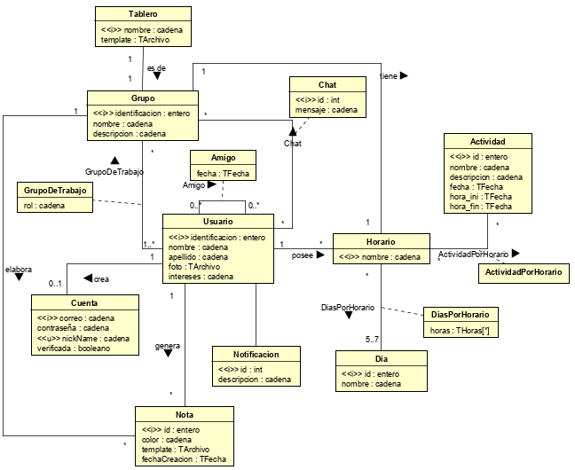
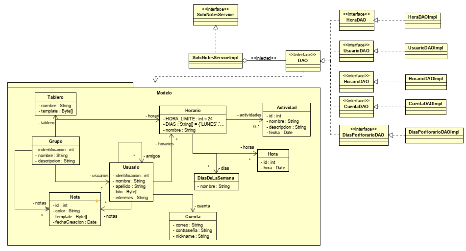

# Diagramas

Para entender mejor la herramienta, diseñamos los modelos de componentes, de datos y de clases, y así lograr mostrar la estructura, cómo está compuesta y cómo funciona nuestra herramienta.

* Diagrama de Componentes:

* Modelo de datos:

* Diagrama de clases:

