# Vistas

### Vista de la página de inicio

La página de inicio \(index\), muestra una breve información sobre la aplicación e imágenes que permiten ver las diferentes funcionalidades de la herramienta.

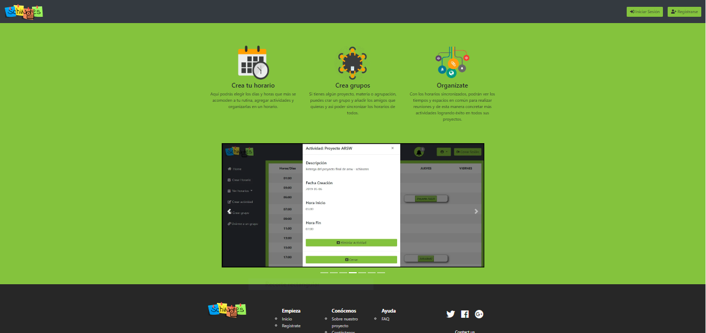

### Vista del registro

Aquí un usuario tienen la posibilidad de registrarse dentro de la aplicación llenando todos los campos como se muestra a continuación. Cuando el usuario se registra, se le envía al correo registrado un mensaje de bienvenida junto con un código de verificación de la cuenta para que pueda acceder.

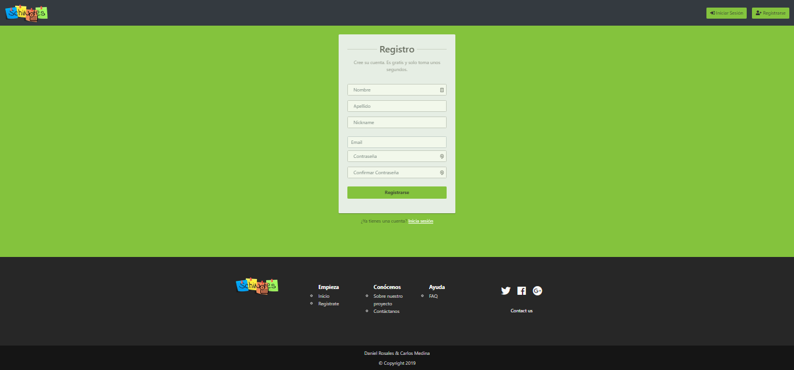

### Vista del inicio de sesión

Los usuarios que ya tienen una cuenta creada dentro de la herramienta, pueden iniciar sesión y de esta manera comenzar a usar las diferentes funcionalidades que la aplicación trae consigo.

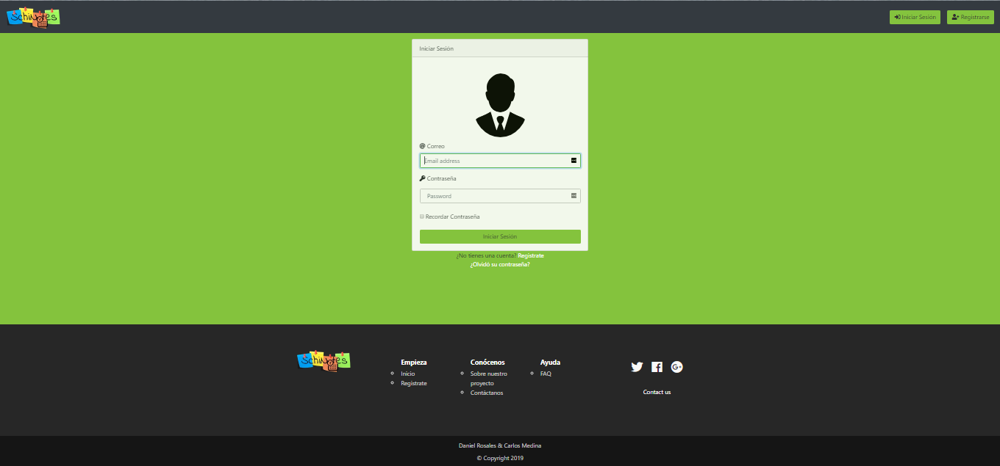

### Vista de la página home

Una vez autenticados, los usuarios pueden comenzar a crear sus horarios, sus actividades, grupos, ver notificaciones provenientes de los grupos, entre otras funcionalidades que les permitirán organizar sus espacios, tiempos y tareas de una forma dinámica y rápida.

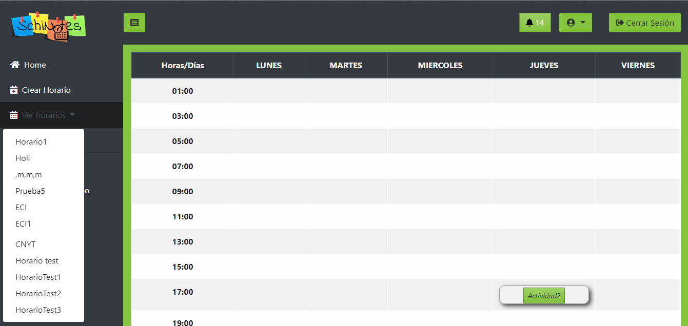

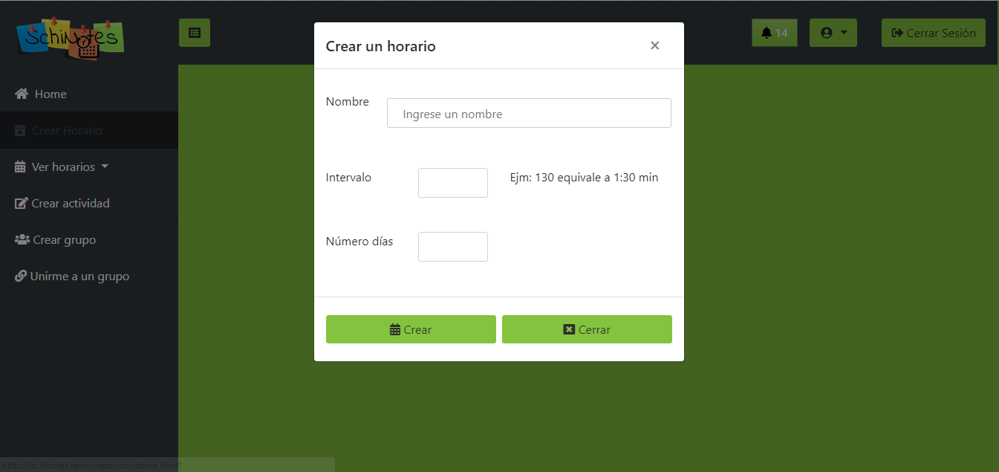

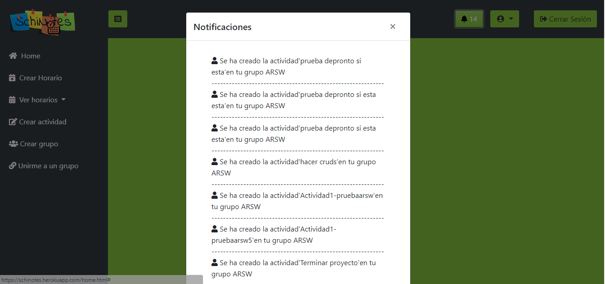

### Vista del perfil del usuario

Es posible que el usuario pueda ver su perfil. Encontrará una carta con sus nombres y apellidos, su imagen, los intereses que tenga y la cantidad de amigos que tenga hasta el momento. Esto significa que también desde esta vista será capaz de buscar amigos y de agregarlos, además de ver los grupos a los cuales pertenece.

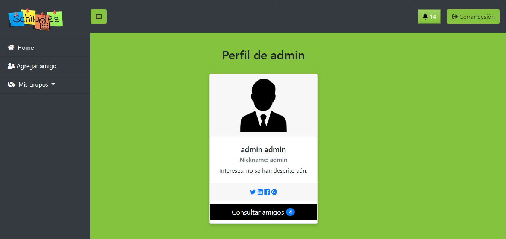

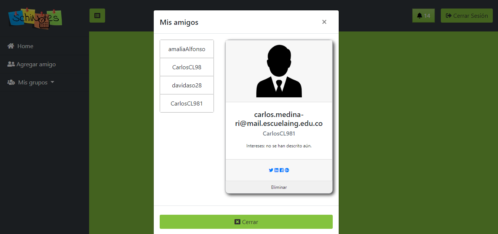

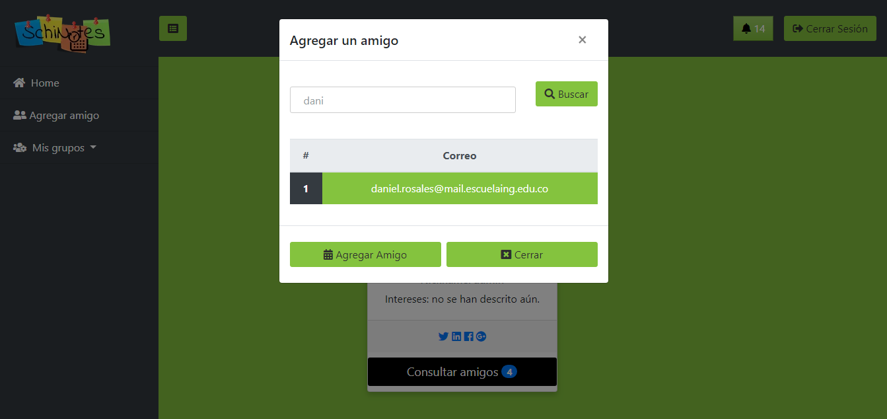

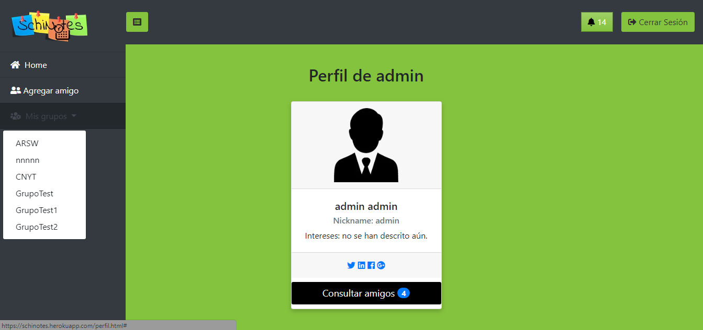

### Vista de un grupo

Desde un grupo, los integrantes pueden ser capaces de crear nuevas actividades. La creación de estas actividades es notificada a todos los participantes y al mismo tiempo todos pueden ver la creación de dichas actividades en el instante en que son creadas. Dentro del grupo también hay un chat para aclarar ideas entre todos los miembros.

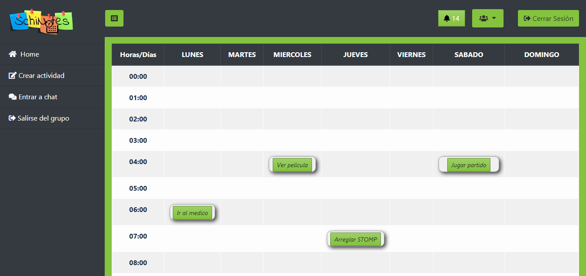

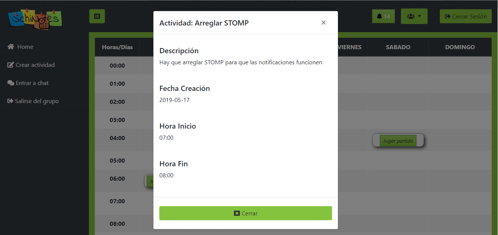

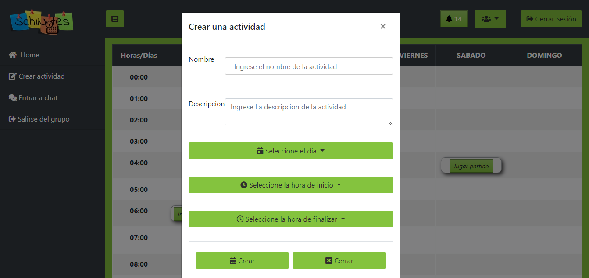

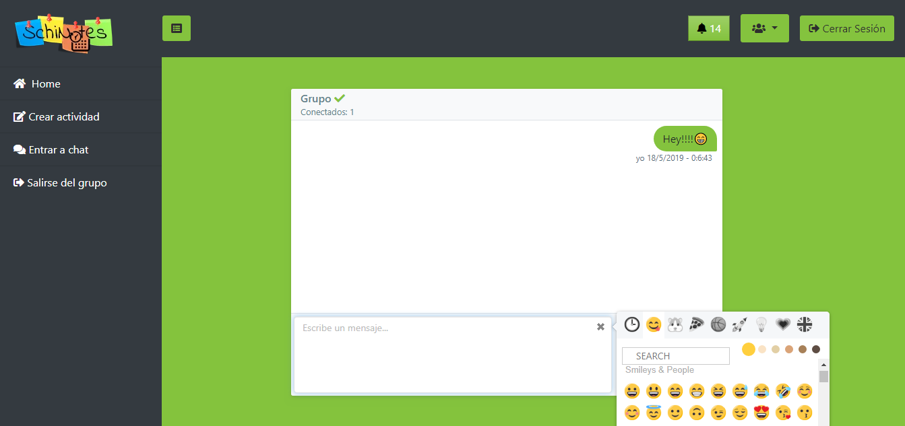

